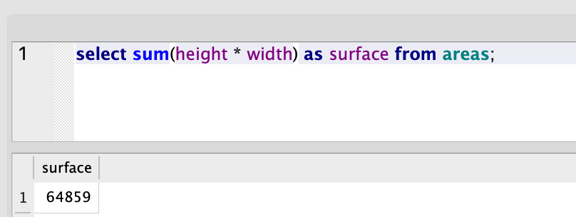
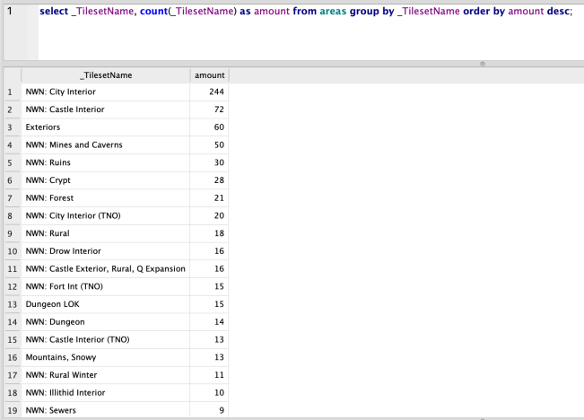
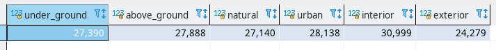
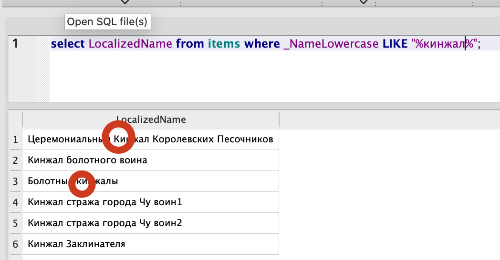

# Example queries for nwn_sqlite tables
Some useful, interesting or funny example queries.

## Area related

### Total surface of a world in tiles


### Most used tilesets


### Surface by type

```sql
select
(select sum(height * width) from areas  group by _FlagUnderground having _FlagUnderground = 1) as under_ground,
(select sum(height * width) from areas  group by _FlagUnderground having _FlagUnderground = 0) as above_ground,
(select sum(height * width) from areas  group by _FlagNatural having _FlagNatural = 1) as natural,
(select sum(height * width) from areas  group by _FlagNatural having _FlagNatural = 0) as urban,
(select sum(height * width) from areas  group by _FlagInterior having _FlagInterior = 1) as interior,
(select sum(height * width) from areas  group by _FlagInterior having _FlagInterior = 0) as exterior;
```

## Lower case name in unicode
SQL lower() function only works on ASCII.  

