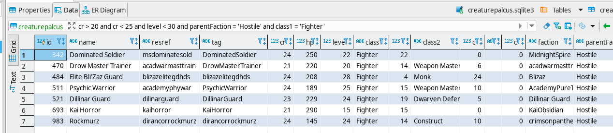

# nwn_sqlite
Extracts information from a [Neverwinter Nights](https://www.beamdog.com/games/neverwinter-nights-enhanced/) module and saves it to a [sqlite3](https://www.sqlite.org/index.html) file. sqlite databases can be read and queried via nwscript beginning with version 8193.14.

This program is written in [Nim](https://nim-lang.org/) and uses the excellent [neverwinter.nim](https://github.com/niv/neverwinter.nim) library to do all the work.



For [table schemas see below](#table-schemas).

## Download binaries
Binaries are available for download on the [releases](https://github.com/hendrikgit/nwn_sqlite/releases) page.

## What exactly does it do?
It reads the information from Neverwinter files. A .mod file could be read. Also various GFF files like `.utc`, `.uti` and so on. Names are looked up by reading the relevant `.2da` files and looking up strrefs in `dialog.tlk` or a possible custom tlk. The paths to these additional resources have to be provided as command line arguments.

That data is then written to a sqlite3 database file.

## Usage
A good start is to run the program and keep adding paths, there should be (hopefully) helpful error messages.  
Don't forget the servers override folder.

**Warning: Existing tables in the sqlite database file will be dropped (and recreated and filled with new data).**

Example program call on Linux:
```
./nwn_sqlite -o:sf.sqlite3 ~/server/modules/SoulForge.mod ~/Beamdog\ Library/00785/lang/en/data/ ~/Beamdog\ Library/00785/data/ ~/server/tlk/ ~/server/hak ~/server/override
```

## Language
A dialog.tlk file of any language should work. The language of the provided dialog.tlk will also be used when looking up localized strings. If a localized string has no entry for the language the dialog.tlk is in, then next english will be tried and lastly the first language with a value

Table column names will not change.

## Why do I need this?
Having this sqlite table will allow you to query information comfortably and quickly via nwscript. Perhaps to select the most fitting creatures to spawn for an encounter. The sqlite database can be used by many other tools, too, like the graphical database tool seen in the screenshot above for a great overview.  

## Speed
On my computer with my module file it takes less than a second to create the sqlite3 file. This tool could possibly be run at each nwserver start to always have up to date information for the running module.

## Build
* Install [Nim](https://nim-lang.org/)
* Clone this repo
* A sqlite3 library (like libsqlite3 on Debian) needs to be installed on your system (or see the last point)
* Run `nimble build -d:release`
* For creating a static binary use the nimble tasks defined in [nwn_sqlite.nimble](nwn_sqlite.nimble). Run `nimble musl`. This assumes you are on Linux.

## Table schemas
Schemas for the tables in the sqlite3 database file that will be written.  
To generate schema output like what is seen below run:
```
sqlite3 dbname.sqlite3 < schemas.sqlite | sed -r 's/.{9}$//'
```
[schemas.sqlite](schemas.sqlite) contains the commands to generate the table info.

Tables
* [creatures](#creatures)
* [items](#items)

### creatures
```
cid  name                      type
---  ------------------------  -------
0    id                        integer
1    name                      text
2    resref                    text
3    tag                       text
4    palette                   text
5    palette_full              text
6    palette_id                integer
7    cr                        integer
8    cr_adjust                 integer
9    hp                        integer
10   level                     integer
11   class1                    text
12   class1_id                 integer
13   class1_level              integer
14   class2                    text
15   class2_id                 integer
16   class2_level              integer
17   class3                    text
18   class3_id                 integer
19   class3_level              integer
20   faction                   text
21   faction_id                integer
22   parent_faction            text
23   parent_faction_id         integer
24   race                      text
25   race_id                   integer
26   gender                    text
27   gender_id                 integer
28   alignment                 text
29   alignment_lawful_chaotic  integer
30   alignment_good_evil       integer
31   natural_ac                integer
32   str                       integer
33   dex                       integer
34   con                       integer
35   int                       integer
36   wis                       integer
37   cha                       integer
38   lootable                  integer
39   disarmable                integer
40   is_immortal               integer
41   no_perm_death             integer
42   plot                      integer
43   interruptable             integer
44   walk_rate                 integer
45   conversation              text
46   comment                   text
```

### items
```
cid  name                      type
---  ------------------------  -------
0    id                        integer
1    name                      text
2    resref                    text
3    tag                       text
4    base_item                 text
5    base_item_id              integer
6    palette                   text
7    palette_full              text
8    palette_id                integer
9    identified                integer
10   stack_size                integer
11   stacking_baseitems        integer
12   charges                   integer
13   cost                      integer
14   add_cost                  integer
15   cursed                    integer
16   plot                      integer
17   stolen                    integer
18   comment                   text
```